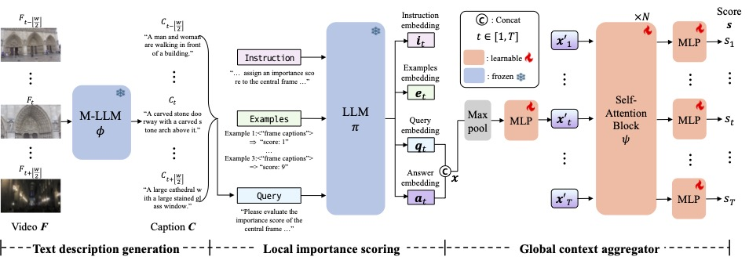

# Video Summarization with Large Language Models (CVPR25) [[Paper](https://arxiv.org/abs/2504.11199) | [Project](https://postech-cvlab.github.io/LLMVS/)]

## Project Overview

LLMVS is a video summarization framework that leverages the capabilities of recent Large Language Models (LLMs). Our method translates video frames into captions using a Multi-modal Large Language Model (M-LLM) and assesses frame importance through an LLM based on local context. These local importance scores are refined through a global attention mechanism, ensuring summaries effectively reflect both details and the overarching narrative.
<p align="center">
  
</p>


## Environment Setup

### Installation

1. **Clone Repository**
```bash
git clone https://github.com/mlee47/LLMVS.git
cd LLMVS
```

2. **Create and Activate Virtual Environment**
```bash
conda create -n llmvs python=3.8
conda activate llmvs
pip install pip==23.3.2
conda install hdf5=1.10.6 h5py=2.10.0
pip install -r requirements.txt
```

## Dataset Download and Preparation

### 1. [SumMe Dataset](https://link.springer.com/chapter/10.1007/978-3-319-10584-0_33)
- **Download Path**: [PGL-SUM](https://github.com/e-apostolidis/PGL-SUM) or [direct download](https://postechackr-my.sharepoint.com/:u:/g/personal/minjlee_postech_ac_kr/ERI3BdvHvRpKo2C2juIQ_SABPU57AuSwVRH82YUxeIJ_Gg?e=SBzzWr)

### 2. [TVSum Dataset](https://openaccess.thecvf.com/content_cvpr_2015/papers/Song_TVSum_Summarizing_Web_2015_CVPR_paper.pdf)
- **Download Path**: [PGL-SUM](https://github.com/e-apostolidis/PGL-SUM) or [direct download](https://postechackr-my.sharepoint.com/:u:/g/personal/minjlee_postech_ac_kr/EaNsh4-U7_hHuSYeIpDNTzwBpl9OQ15HF0vViXQffCHy4A?e=2AscX5)

### 3. LLaMA Embeddings
- **SumMe LLaMA Embeddings**: [download](https://postechackr-my.sharepoint.com/:u:/g/personal/minjlee_postech_ac_kr/ERuUPKMtVWtPqckLcZScfxABeZ8Bf7pdY4mOr6n1YiYRyA?e=nk03C7)
- **TVSum LLaMA Embeddings**: [download](https://postechackr-my.sharepoint.com/:u:/g/personal/minjlee_postech_ac_kr/EUgQbZLHncdArH_46PRKQK0B1FoDyJM_Z2SIXSf7kPwhOg?e=U17jmq)
- **+)** **[MR.HiSum](https://github.com/MRHiSum/MR.HiSum) LLaMA Embeddings**: [download](https://postechackr-my.sharepoint.com/:u:/g/personal/minjlee_postech_ac_kr/EeqqunowlHhIvZAiTdJ6vLgBwNOEDDq4TUaUCqwOgebfeQ?e=dPVMZg)

**Note**: All LLaMA embeddings are max-pooled.

### 4. Data Directory Structure

Download the datasets and LLaMA embeddings, then organize them in the following directory structure:

```
LLMVS/
├── llama_emb/
│   ├── summe_sum/
│   │   ├── gen/gen_pool.h5
│   │   └── user_prompt/user_prompt_pool.h5
│   └── tvsum_sum/
│       ├── gen/gen_pool.h5
│       └── user_prompt/user_prompt_pool.h5
├── SumMe/
│   └── eccv16_dataset_summe_google_pool5.h5
├── TVSum/
    ├── eccv16_dataset_tvsum_google_pool5.h5
    └── ydata-tvsum50-anno.tsv
```

## Training Method

### 1. Training Script

We use 5 GPUs for distributed training.

```bash
bash train.sh
```

### 2. Individual Training Commands

**SumMe Dataset Training**:
```bash
python train.py --tag summe_split0 --model summe_head2_layer3 --lr 0.000119 --epochs 200 --dataset summe --reduced_dim 2048 --num_heads 2 --num_layers 3 --split_idx 0 --pt_path 'llama_emb/summe_sum/'
```

**TVSum Dataset Training**:
```bash
python train.py --tag tvsum_split0 --model tvsum_head2_layer3 --lr 0.00007 --epochs 200 --dataset tvsum --reduced_dim 2048 --num_heads 2 --num_layers 3 --split_idx 0 --pt_path 'llama_emb/tvsum_sum/'
```

### 3. Key Hyperparameters

- `--dataset`: Dataset selection (`summe` or `tvsum`)
- `--split_idx`: Data split index (0-4)
- `--epochs`: Number of training epochs (default: 200)
- `--lr`: Learning rate
  - SumMe: 0.000119
  - TVSum: 0.00007
- `--reduced_dim`: Dimension reduction size (default: 2048)
- `--num_heads`: Number of Transformer heads (default: 2)
- `--num_layers`: Number of Transformer layers (default: 3)


## Trained Models

### Download Checkpoints

You can download model checkpoints from the following link:

**Model Checkpoints**: [Download](https://postechackr-my.sharepoint.com/:u:/g/personal/minjlee_postech_ac_kr/EdCaVWFqZV9JrJwENbT7A1UBkOJEFwG3-98Bwx6xkDiZpA?e=ItLlmP)

### Directory Structure

After downloading, extract the checkpoints to the following directory structure:

```
LLMVS/
├── Summaries/
│   ├── {SumMe model_name}/          
│   │   └── summe/
│   │       ├── summe_split0/
│   │       │   ├── best_rho_model/ 
│   │       │   ├── best_tau_model/ 
│   │       │   └── configuration.txt
│   │       ├── summe_split1/
│   │       ├── ...
│   │       └── summe_split4/
│   └── {TVSum model_name}/         
│       └── tvsum/
│           ├── tvsum_split0/
│           │   ├── best_rho_model/ 
│           │   ├── best_tau_model/ 
│           │   └── configuration.txt
│           ├── tvsum_split1/
│           ├── ...
│           └── tvsum_split4/
```

## Evaluation Method

### 1. Evaluation Script

```bash
bash test.sh
```

### 2. Individual Evaluation

```bash
CUDA_VISIBLE_DEVICES=0,2,4,5,6 python test.py --dataset {dataset} --split_idx 0 --tag {tag}  --weights 'Summaries/{model_name}/{dataset}/{tag}/ckpt_file' --pt_path llama_emb/{dataset}/ --result_dir 'Summaries/{model_name}/{dataset}/' --num_heads 2 --num_layers 3 --reduced_dim 2048
```


## Citation

When using this project, please cite as follows:

```bibtex
@inproceedings{lee2025video,
  title={Video Summarization with Large Language Models},
  author={Lee, Min Jung and Gong, Dayoung and Cho, Minsu},
  booktitle={Proceedings of the Computer Vision and Pattern Recognition Conference},
  pages={18981--18991},
  year={2025}
}
```
